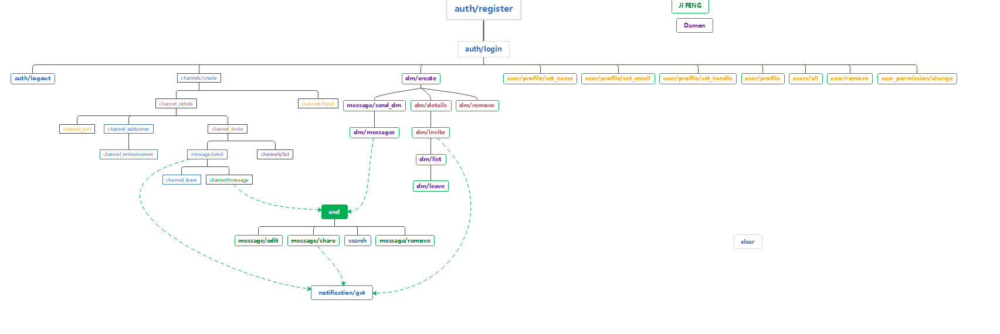

## Assumption

This is our function tree for iteration 2.The diagram shows the dependencies between the function of a system



In order to make our database more "smarter", we decide to do write our function like this:

```python
Load_db()
#do something
save_db()
return #somthing
```

It allows us to handle concurrency situation and the ability to store our data if the power is suddenly shut down

## Users

+ **All the user_id** will be generated from 0 and increase 1 every time when new user is registered

+ If a user is deleted, the user id will be **keep exist** and will not be used for further user

  > A registers as id 01
  >
  > B registers as id 02
  >
  > C registers as id 03
  >
  > **B deletes its account**
  >
  > D registers as id  **04**

+ Two different users may have the same name and password, but their user_id, handle and email **should not** be the same 

  ---

  

### auth_register_v2

---

**Parameters:(email, password, name_first, name_last)**

**Return Type:{token, auth_user_id}**


* password should be more than **6 characters long**

* first name and last name both should be between  **1 and 50 characters **

* Handle :**lowercase-only first name + last name**
  
   * the concatenation is **less than 20 characters**
   
   * if the handle does exits, then the new one should be like this
   
     ```python
     handle1:helloworld
     handle2:helloworld0
     handle3:helloworld1
     ```
   
   

- token: a string to check the user's authorisation and it is encode by **hash function 256**
- The first user to register is considered as  **the dream owner**


### user_profile_v2

---

**Parameters:(token, u_id)**

**Return Type:{user}**


* return **AccessError** if the token is invalid


### user_profile_setname_v2

---

**Parameters:(token, name_first, name_last)**

**Return Type:{}**


* return **AccessError** if the token is invalid

* first name and last name both should be between  **1 and 50 characters**

* Handle :**lowercase-only first name + last name**


### user_profile_setemail_v2

---

**Parameters:(token, email)**

**Return Type:{}**


* return **AccessError** if the token is invalid

* new email should be **valid** and not yet taken


### user_profile_sethandle_v2

---

**Parameters:(token, handle_str)**

**Return Type:{}**


* return **AccessError** if the token is invalid

* new handle should be **between 3 and 20 characters inclusive** and not yet taken


Channels
---

* The rule of channel id is similar to user id, generate from 0, and increase 1 every time

* If a channel is deleted, the channel id will be **keep exist** and will not be used for further channel

  > channel A creates as id 01
  >
  > channel B creates as id 02
  >
  > channel C creates as id 03
  >
  > **channel B is deleted**
  >
  > channel D creates as id  **04**

* Different channel may have the same channel_name, but their channel_id **should be** different

+ **The creator of the channel** will **automatically** become the channel member
+ The channel_id is **distinct**
+ All the channel function will raise **InputError** if the input channel_id is **not valid**

## channel_invite_v2

**Parameters:(token, channel_id, u_id)**

**Return Type:{} **

+ The function will return **nothing** if the user is already in the channel
+ **Only** the member of the channel can invite other people
+ Function will raise InputError when channel_id does not refer to a valid channel.
+ Function will raise InputError when u_id does not refer to a valid user.
+ Function will raise AccessError when the authorised user is not already a member of the channel.
+ Function will raise Inputerror when the given token does not refer to valid user.

## channel_join_v2

**Parameters:(token, channel_id)**

**Return Type:{} **

* Function will raise an InputError if the channel_id does not exist (which is not valid).

* Function will raise an AccessError if the user does not have permission to join the channel.

* Function will do **nothing** if the user is already exist in the channel. 


## channel_details_v2

**Parameters:(token, channel_id)**

**Return Type:{name, is_public, owner_members,  all_members} **

* Function will raise InputError when channel_id is not a valid channel.
* Function will raise AccessError when authorised user is not a member of channel with channel_id.
* Function will raise Inputerror when the given token does not refer to valid user.

## channel_addowner_v1

**Parameters:(token, channel_id, u_id)**

**Return Type:{} **

- As long as the user who is trying to add owner is the owner of the **dreamer**, then he can set anyone to become the owner of the channel
- The InputError will be raised when the channel_id is not **valid** or the u_id is not **valid**
- The AccessorError will be raised when the toke does not refer to the *owner of the dream*  or the *owner of the channel* 

## channel_removeowner_v1

**Parameters:(token, channel_id, u_id)**

**Return Type:{} **

- The owner of the channel can remove himself as well as long as **there is at least one remaining owner left**
- The InputError will be raised when the channel_id is not **valid** or the u_id is not **valid**
- The AccessorError will be raised when the toke does not refer to the *owner of the dream*  or the *owner of the channel*

## channel_leave_v1

**Parameters:(token, channel_id)**

**Return Type:{} **

- If the *last person* leaves the channel, the channel will not be "physically" destroyed since the **dream owner can invite other user into the channel**
- The InputError will be raised when the channel_id is not **valid** 
- The AccessorError will be raised when the token does not refer to the *member of the channel*

## dm_leave_v1

**Parameters:(token, dm_id)**

**Return Type:{} **

- If the *last person* leaves the channel, the channel will not be "physically" destroyed since the **dream owner can invite other user into the dm**
- The InputError will be raised when the dm_id is not **valid** 
- The AccessorError will be raised when the token does not refer to the *member of the dm

## dm_invite_v1

**Parameters:(token, dm_id, u_id)**
**Return Type:{} **
+ The function will return **nothing** if the user is already in the dm
+ **Only** the member of the dm can invite other people
+ Function will raise InputError when dm_id does not refer to a valid dm.
+ Function will raise InputError when u_id does not refer to a valid user.
+ Function will raise AccessError when the authorised user is not already a member of the channel.
+ Function will raise Inputerror when the given token does not refer to valid user.

## dm_details_v1

**Parameters:(token, dm_id)**
**Return Type:{name, members} **
* Function will raise InputError when dm_id is not a valid channel.
* Function will raise AccessError when authorised user is not a member of channel with channel_id.
* Function will raise Inputerror when the given token does not refer to valid user.

## dm_remove_v1

**Parameters:(token, dm_id)**
**Return Type:{} **
* Function will raise InputError when dm_id is not a valid channel.
* Function will raise AccessError when the user is not the original DM creator.
* Function will raise Inputerror when the given token does not refer to valid user.

## admin_user_remove_v1

**Parameters:(token, u_id)**

**Return Type:{} **

- Dream owner can not set himself to member, if there is only one dream owner

## admin_userpermission_change_v1

**Parameters:(token, u_id, permission_id)**

**Return Type:{} **

- after removing the target user, the name of the messages should be also "Removed user"
- Dream owner can remove himself if there is more than one dream owner

## search_v2

**Parameters:(token, query_str)**

**Return Type:{messages} **

- The result will be showed in alphabetic order
- The InputError will be raised when the query_str is above 1000 characters


# Message

## Message_share_v1

When a message is shared, it can use the shared message to tagged users, and also, if the message they shared has any tagged message, the user will get another notification

## Message_edit_v1

When the message is edited to an tagged form, the user who is tagged will get the notification


